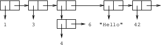
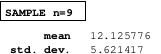
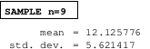
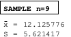

## Inspector

The inspector, called "Clouseau", is used for interactively inspecting
objects. It lets you look inside objects, inspect slots, disassemble and
trace functions, view keys and values in hash tables, and quite a few
other things as well. It can be extended to aid in debugging of specific
programs, similar to the way the Lisp printer can be extended with
`print-object`.

### Usage

#### Quick Start

To get up and running quickly with Clouseau:

-   Load Clouseau like this: `(asdf:load-system :clouseau)`

-   Inspect an object with `(clouseau:inspector object)`. If you use a
    multithreaded Lisp implementation, you can also include the
    `:new-process` keyword argument. If it is `t`, then Clouseau is
    started in a seperate process. This should be relatively safe; it is
    even possible to have an inspector inspecting another running
    inspector.

#### The Basics

Once you inspect something, you will see a full representation of the
object you are inspecting and short representations of objects contained
within it. This short representation may be something like
`#<STANDARD-CLASS SALAD-MIXIN>` or something as short as "$\cdots$". To
see these objects inspected more fully, left-click on them and they will
be expanded. To shrink expanded objects, left-click on them again and
they will go back to a brief form.

That's really all you need to know to get started. The best way to learn
how to use Clouseau is to start inspecting your own objects.

#### Handling of Specific Data Types

Clouseau can handle numerous data types in different ways. Here are some
handy features you might miss if you don't know to look for them:

##### Standard Objects

Standard objects have their slots shown, and by left-clicking on the
name of a slot you can change the slot's value. You can see various slot
attributes by middle clicking on a slot name.

##### Structures

Structures are inspected the same way as standard objects.

##### Generic Functions

You can remove methods from generic functions with the `Remove Method`
command.

##### Functions

You can disassemble functions with the `Toggle Disassembly` command. If
the disassembly is already shown, this command hides it.

##### Symbols

If a symbol is fbound, you can use the `Trace` and `Untrace` commands to
trace and untrace the function bound to it.

##### Lists and Conses

Lists and conses can be displayed in either the classic format (such as
`(1 3 (4 . 6) "Hello" 42)`) or a more graphical cons-cell diagram
format. The default is the classic format, but this can be toggled with
the `Toggle Show List Cells` command.

The new cons cell diagram format is shown in .



### Extending Clouseau

Sometimes Clouseau's built-in inspection abilities aren't enough, and
you want to be able to extend it to inspect one of your own classes in a
special way. Clouseau supports this, and it's fairly simple and
straightforward.

Suppose that you're writing a statistics program and you want to
specialize the inspector for your application. When you're looking at a
sample of some characteristic of a population, you want to be able to
inspect it and see some statistics about it, like the average. This is
easy to do.

We define a class for a statistical sample. We're keeping this very
basic, so it'll just contain a list of numbers:

```commonlisp
    (in-package :clim-user)
    (use-package :clouseau)

    (defclass sample ()
      ((data :initarg :data
             :accessor data
             :type list :initform '()))
      (:documentation "A statistical sample"))

    (defgeneric sample-size (sample)
      (:documentation "Return the size of a statistical sample"))

    (defmethod sample-size ((sample sample))
      (length (data sample)))
```

The `print-object` function we define will print samples unreadably,
just showing their sample size. For example, a sample with nine numbers
will print as `#<SAMPLE n=9>` We create such a sample and call it
`*my-sample*`.

```commonlisp
    (defmethod print-object ((object sample) stream)
      (print-unreadable-object (object stream :type t)
        (format stream "n=~D" (sample-size object))))

    (defparameter *my-sample*
      (make-instance 'sample
                     :data '(12.8 3.7 14.9 15.2 13.66
                             8.97 9.81 7.0 23.092)))
```

We need some basic statistics functions. First, we'll do sum:

```commonlisp
    (defgeneric sum (sample)
      (:documentation "The sum of all numbers in a statistical
    sample"))

    (defmethod sum ((sample sample))
      (reduce #'+ (data sample)))
```

Next, we want to be able to compute the mean. This is just the standard
average that everyone learns: add up all the numbers and divide by how
many of them there are. It's written $\overline {x}$.

```commonlisp
    (defgeneric mean (sample)
      (:documentation "The mean of the numbers in a statistical
    sample"))

    (defmethod mean ((sample sample))
      (/ (sum sample)
         (sample-size sample)))
```

Finally, to be really fancy, we'll throw in a function to compute the
standard deviation. You don't need to understand this, but the standard
deviation is a measurement of how spread out or bunched together the
numbers in the sample are. It's called $s$, and it's computed like this:
$s = \sqrt{{1 \over N-1} \sum_{i=1}^N (x_i - \overline {x})^2}$.

```commonlisp
    (defgeneric standard-deviation (sample)
      (:documentation "Find the standard deviation of the numbers
    in a sample. This measures how spread out they are."))

    (defmethod standard-deviation ((sample sample))
      (let ((mean (mean sample)))
        (sqrt (/ (loop for x in (data sample)
                       sum (expt (- x mean) 2))
                 (1- (sample-size sample))))))
```

This is all very nice, but when we inspect `*my-sample*` all we see is a
distinctly inconvenient display of the class, its superclass, and its
single slot, which we actually need to *click on* to see. In other
words, there's a lot of potential being missed here. How do we take
advantage of it?

We can define our own inspection functions. To do this, we have two
methods that we can define. To change how sample objects are inspected
compactly, before they are clicked on, we can define an
`inspect-object-briefly` method for our `sample` class. To change the
full, detailed inspection of samples, we define `inspect-object` for the
class. Both of these methods take two arguments: the object to inspect
and a CLIM output stream. They are expected to print a representation of
the object to the stream.

Because we defined `print-object` for the `sample` class to be as
informative as we want the simple representation to be, we don't need to
define a special `inspect-object-briefly` method. We should, however,
define `inspect-object`.

```commonlisp
    (defmethod inspect-object ((object sample) pane)
      (inspector-table (object pane)
          ;; This is the header
          (format pane "SAMPLE n=~D" (sample-size object))
        ;; Now the body
        (inspector-table-row (pane)
          (princ "mean" pane)
          (princ (mean object) pane))
        (inspector-table-row (pane)
          (princ "std. dev." pane)
          (princ (standard-deviation object) pane))))
```

Here, we introduce two new macros. `inspector-table` sets up a box in
which we can display our representation of the sample. It handles quite
a bit of CLIM work for us. When possible, you should use it instead of
making your own, since using the standard facilities helps ensure
consistency.

The second macro, `inspector-table-row`, creates a row with the output
of one form bolded on the left and the output of the other on the right.
This gives us some reasonably nice-looking output as shown in .



But what we really want is something more closely adapted to our needs.
It would be nice if we could just have a table of things like
$\overline {x} = 12.125776$ and have them come out formatted nicely.
Before we attempt mathematical symbols, let's focus on getting the basic
layout right. For this, we can use CLIM's table formatting.

```commonlisp
    (defmethod inspect-object ((object sample) pane)
      (inspector-table (object pane)
          ;; This is the header
          (format pane "SAMPLE n=~D" (sample-size object))
        ;; Now the body
        (inspector-table-row (pane)
          (princ "mean" pane)
          (princ (mean object) pane))
        (inspector-table-row (pane)
          (princ "std. dev." pane)
          (princ (standard-deviation object) pane))))
```

In this version, we define a local function `x=y` which outputs a row
showing something in the form "label = value". If you look closely,
you'll notice that we print the label with `princ` but we print the
value with `inspect-object`. This makes the value inspectable, as it
should be.

Then, in the `inspector-table` body, we insert a couple of calls to
`x=y` and we're done. The new output is shown in in



Finally, for our amusement and further practice, we'll try to get some
mathematical symbols---in this case we'll just need $\overline
{x}$. We can get this by printing an italic $x$ and drawing a line over
it:

```commonlisp
    (defun xbar (stream)
      "Draw an x with a bar over it"
      (with-room-for-graphics (stream)
        (with-text-face (stream :italic)
          (princ #\x stream)
          (draw-line* stream 0 0
                      (text-style-width *default-text-style*
                                        stream) 0))))

    (defmethod inspect-object ((object sample) pane)
      (flet ((x=y (x y)
               (formatting-row (pane)
                 (formatting-cell (pane :align-x :right)
                   ;; Call functions, print everything else in italic
                   (if (functionp x)
                       (funcall x pane)
                       (with-text-face (pane :italic)
                         (princ x pane))))
                 (formatting-cell (pane) (princ "=" pane))
                 (formatting-cell (pane)
                   (inspect-object y pane)))))
        (inspector-table (object pane)
            ;; This is the header
            (format pane "SAMPLE n=~D" (sample-size object))
          ;; Now the body
          (x=y #'xbar (mean object))
          (x=y #\S (standard-deviation object)))))
```

Finally, to illustrate the proper use of `inspect-object-briefly`,
suppose that we want the "n=9" (or whatever the sample size $n$ equals)
part to have an itlicised $n$. We can fix this easily:

```commonlisp
    (defmethod inspect-object-briefly ((object sample) pane)
      (with-output-as-presentation (pane object 'sample)
        (with-text-family (pane :fix)
          (print-unreadable-object (object pane :type t)
            (with-text-family (pane :serif)
              (with-text-face (pane :italic)
                (princ "n" pane)))
            (format pane "=~D" (sample-size object))))))
```

Notice that the body of `inspect-object-briefly` just prints a
representation to a stream, like `inspect-object` but shorter. It should
wrap its output in `with-output-as-presentation`. `inspect-object` does
this too, but it's hidden in the `inspector-table` macro.

Our final version is shown in .



For more examples of how to extend the inspector, you can look at
`inspector.lisp`.

### API

The following symbols are exported from the `clouseau` package:

~[Function]~

inspector :
:   *object **&key** new-process*

	Inspect `object`. If `new-process` is `t`, Clouseau will be run in a new
	process.
	
~[Generic Function]~

inspect-object :
:   *object pane*

	Display inspected representation of `object` to the extended output
	stream `pane`. This requires that `*application-frame*` be bound to an
	inspector application frame, so it isn't safe to use in other
	applications.
	
~[Generic Function]~

inspect-object-briefly :
:   *object pane*

	A brief version of `inspect-object`. The output should be short, and
	should try to fit on one line.

~[Generic Function]~

define-inspector-command :
:   *name args **&rest** body*

	This is just an inspector-specific version of `define-command`. If you
	want to define an inspector command for some reason, use this.

~[Macro]~

inspector-table :
:   *object pane header **&body** body*

	Present `object` in tabular form on `pane`, with `header` evaluated to
	print a label in a box at the top. `body` should output the rows of the
	table, possibly using `inspector-table-row`.

~[Macro]~

inspector-table-row:
:   *pane left right*

	Output a table row with two items, produced by evaluating `left` and
	`right`, on `pane`. This should be used only within `inspector-table`.

When possible, you should try to use this and `inspector-table` for
consistency, and because they handle quite a bit of effort for you.
